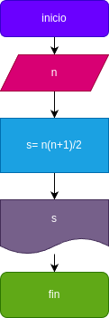

# Suma_n_numeros
suma de los n primeros numeros naturales

# Analisis

## Imput
s

### Variables de entrada
n: numero al que se desea aplicar la formula
### processing
s= suma de los n primeros numeros 

s=n(n+1)/2

### Output
s
# Diseño

# Construccion 
